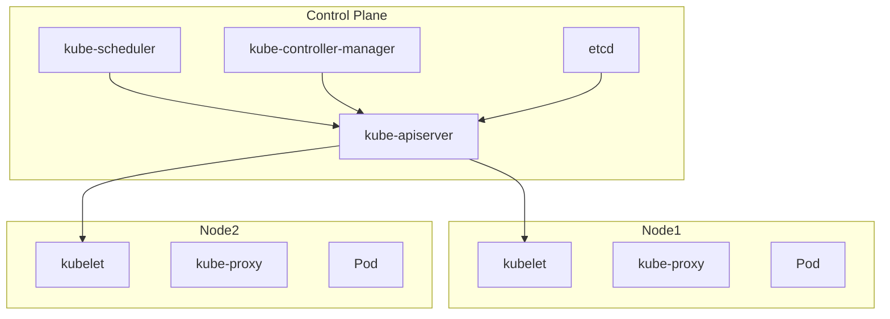
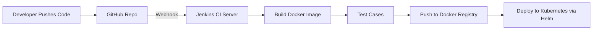
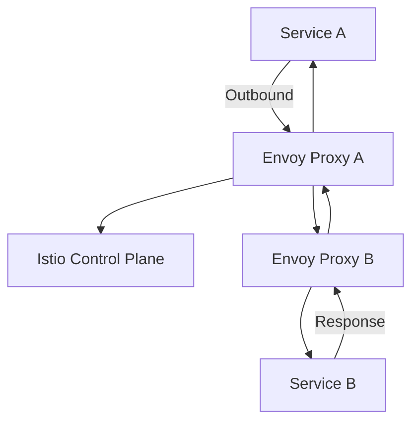

# AWS Interview Preparation Guide

This guide contains the most commonly asked AWS interview questions, along with detailed explanations and real-world examples. It covers IAM, S3, VPC, CloudWatch, CloudTrail, and more — perfect for cloud engineers, developers, and architects preparing for technical interviews.

---

## 📌 1. What all services are used in AWS?

AWS offers over **200 services** across various domains. Below are the most commonly used:

### ✅ Compute
- **EC2** – Virtual servers (Linux/Windows)
- **Lambda** – Serverless function execution
- **ECS / EKS** – Container orchestration

### ✅ Storage
- **S3** – Object storage
- **EBS** – Block storage for EC2
- **EFS** – Shared file storage

### ✅ Database
- **RDS** – Managed relational DBs (MySQL, PostgreSQL)
- **DynamoDB** – NoSQL, key-value store
- **Aurora**, **Redshift**, **DocumentDB**

### ✅ Networking
- **VPC** – Isolated network in the cloud
- **Route 53** – DNS and routing
- **API Gateway** – API hosting and management
- **CloudFront** – CDN for static content

### ✅ Security & Identity
- **IAM** – Access management
- **Cognito** – User sign-up and sign-in
- **KMS**, **Secrets Manager** – Encryption and secret storage

### ✅ Monitoring & Logging
- **CloudWatch** – Metrics, logs, dashboards
- **CloudTrail** – Auditing API calls

### ✅ Developer Tools
- **CodeBuild**, **CodeDeploy**, **CodePipeline** – CI/CD tools

### ✅ Machine Learning / AI
- **SageMaker** – ML model building
- **Rekognition** – Image/video recognition
- **Comprehend** – NLP services

### ✅ Use Case:
> In one project, we used:
> - **EC2** to host a Django API  
> - **S3** for storing user uploads  
> - **RDS (PostgreSQL)** for structured data  
> - **IAM** for managing dev/staging/prod access  
> - **CloudWatch** for log monitoring and alerting  
> - **CodePipeline** for CI/CD deployments

---

## 📌 2. How to configure S3 bucket access for one particular user?

### ✅ Goal:
Grant a specific IAM user access to a single bucket.

### ✅ IAM Policy Example:

```json
{
  "Version": "2012-10-17",
  "Statement": [
    {
      "Effect": "Allow",
      "Action": ["s3:ListBucket"],
      "Resource": "arn:aws:s3:::my-data-bucket"
    },
    {
      "Effect": "Allow",
      "Action": ["s3:GetObject", "s3:PutObject"],
      "Resource": "arn:aws:s3:::my-data-bucket/*"
    }
  ]
}
```

### ✅ Use Case:
> A user named `data-analyst` needed access to the `my-data-bucket` S3 bucket to upload and read reports.  
> I created an IAM policy scoped to only that bucket and attached it to the user to ensure least privilege access.

---

## 📌 3. How to provide S3 bucket access at folder level?

### ✅ Explanation:
S3 doesn’t have true folders; instead, it uses object key prefixes. You can restrict access to a specific "folder" by using IAM policies that target a prefix.

### ✅ IAM Policy Example:

```json
{
  "Version": "2012-10-17",
  "Statement": [
    {
      "Effect": "Allow",
      "Action": ["s3:GetObject", "s3:PutObject"],
      "Resource": "arn:aws:s3:::project-bucket/team-a/*"
    }
  ]
}
```

### ✅ Use Case:
> In a shared S3 bucket `project-bucket`, each team had its own folder such as `team-a/`, `team-b/`, etc.  
> I granted `team-a` access only to their own folder using a prefix-based policy.  
> This helped isolate access and avoid the need for multiple buckets.

---

## 📌 4. Any experience with CloudWatch Logs, CloudTrail, etc?

### ✅ CloudWatch Overview:
- Collects logs and metrics from AWS services like EC2, Lambda, ECS.
- Supports **alarms**, **dashboards**, and **Logs Insights** for querying logs.
- Useful for real-time monitoring and operational visibility.

### ✅ CloudTrail Overview:
- Records **API calls** across AWS services (via Console, CLI, SDK).
- Includes details such as the user, IP, resource, and action.
- Crucial for **auditing, compliance, and troubleshooting**.

### ✅ Use Case:
> A Lambda function was timing out, but no errors were visible in the app.  
> I used **CloudWatch Logs Insights** to discover that a call to an external API was failing intermittently.  
> Later, when an S3 bucket was mistakenly deleted, **CloudTrail** logs helped trace the delete action to a specific IAM user and script — enabling faster recovery and stronger access policies.

---

## 📌 5. VPC Related Questions

---

### 🔹 a. What is CIDR in a VPC?

**CIDR (Classless Inter-Domain Routing)** defines the IP address range of your VPC and subnets.

### ✅ Example:
- VPC: `10.0.0.0/16` → allows up to 65,536 IPs
- Public subnet: `10.0.1.0/24`
- Private subnet: `10.0.2.0/24`

### ✅ Use Case:
> I created a VPC with CIDR block `10.0.0.0/16` and divided it into `/24` subnets.  
> Public subnets hosted ALBs and Bastion hosts, while private subnets were used for EC2 and RDS.  
> This helped isolate workloads, control traffic, and implement fine-grained security.

---

### 🔹 b. What is a VPC Endpoint?

A **VPC Endpoint** allows secure, private connectivity from your VPC to AWS services without using an internet gateway, NAT, or public IPs.

### ✅ Types:
- **Gateway Endpoint** – Used for S3 and DynamoDB.
- **Interface Endpoint** – Used for services like SSM, Secrets Manager, KMS.

### ✅ Use Case:
> We had EC2 instances in private subnets that needed to access S3 for file storage.  
> Instead of using a NAT Gateway (which adds cost), I created a **Gateway VPC Endpoint**.  
> This reduced cost and improved security by keeping all traffic within AWS's private network.

---

### 🔹 c. What is VPC Peering?

**VPC Peering** allows private IP traffic between two VPCs.

### ✅ Key Characteristics:
- Low-latency and secure.
- Requires route table and security group updates.
- **No transitive routing** (A → B, B → C ≠ A → C).

### ✅ Use Case:
> We had a `data-lake` VPC and a `production` VPC in different AWS accounts.  
> I established VPC Peering to allow secure access between the two environments.  
> After updating routing tables and security groups, services could communicate using private IPs without exposing traffic to the public internet.

---

## ✅ Summary

This guide covered:

- ✅ AWS core services overview  
- ✅ S3 bucket and folder-level IAM access  
- ✅ Monitoring and auditing with CloudWatch and CloudTrail  
- ✅ VPC concepts: CIDR, Endpoints, and Peering  
- ✅ Real-world examples and production-ready use cases

---

_Use this guide as a cheat sheet or starter pack for AWS technical interviews._  
Feel free to extend it with Terraform examples or architecture diagrams. Good luck! 🚀


============================================================================================================================================


Kubernetes Interview Q&A (Clearly Formatted)
========================================

Q1. What is a Namespace?
------------------------
A namespace in Kubernetes is a way to divide cluster resources between multiple users. It helps isolate environments (like dev, test, prod) within the same cluster.

Example:

kubectl create namespace dev

Q2. .kubeconfig usage
---------------------
The .kube/config file contains configuration to connect to Kubernetes clusters (credentials, cluster info, contexts).

Location: ~/.kube/config

Example:

contexts:
- name: dev-context
  context:
    cluster: dev-cluster
    user: dev-user

Q3. Switch the cluster context from CLI
---------------------------------------
kubectl config use-context dev-context

Q4. Check the Pod Logs
----------------------
kubectl logs <pod-name>
kubectl logs <pod-name> -c <container-name>

Q5. Login to Running Container
------------------------------
kubectl exec -it <pod-name> -- /bin/bash
kubectl exec -it <pod-name> -c <container-name> -- /bin/sh

Q6. What is PV and PVC?
-----------------------
PV (Persistent Volume): Storage in the cluster.
PVC (Persistent Volume Claim): Request for storage by user.

Example:

apiVersion: v1
kind: PersistentVolumeClaim
metadata:
  name: mypvc
spec:
  accessModes:
    - ReadWriteOnce
  resources:
    requests:
      storage: 1Gi

Q7. Different Types of Services
-------------------------------
ClusterIP: Default, accessible only within cluster.
NodePort: Exposes service on a static port on each node.
LoadBalancer: Uses external load balancer.
ExternalName: Maps service to external DNS.

Example:

apiVersion: v1
kind: Service
metadata:
  name: myservice
spec:
  type: NodePort
  ports:
    - port: 80
      targetPort: 8080
      nodePort: 30080
  selector:
    app: myapp

Q8. Configure Application Load Balancer (ALB)
---------------------------------------------
For EKS: Use AWS ALB Ingress Controller.

Example:

apiVersion: networking.k8s.io/v1
kind: Ingress
metadata:
  name: my-ingress
  annotations:
    alb.ingress.kubernetes.io/scheme: internet-facing
spec:
  rules:
  - http:
      paths:
      - path: /*
        pathType: ImplementationSpecific
        backend:
          service:
            name: myservice
            port:
              number: 80

Q9. Expose Ports
----------------
kubectl expose deployment myapp --type=NodePort --port=80 --target-port=8080

Q10. Port Forwarding
-------------------
kubectl port-forward svc/myservice 8080:80
# Now access the service via http://localhost:8080

Q11. EKS Versions Worked On
--------------------------
Worked on EKS versions like 1.21, 1.22, and recently upgraded to 1.24.

Q12. EKS Upgrade Experience
--------------------------
Performed in-place upgrades using AWS Console and CLI. Steps included:
- Backing up cluster configs
- Draining nodes
- Upgrading EKS version
- Updating node groups and validating workloads post-upgrade

Q13. What are ConfigMaps?
------------------------
ConfigMaps store non-sensitive key-value pairs (e.g., config settings).

Example:

apiVersion: v1
kind: ConfigMap
metadata:
  name: app-config
data:
  LOG_LEVEL: debug

Q14. Secrets vs ConfigMaps
-------------------------
Secrets store sensitive data (e.g., passwords, tokens).

Example:

apiVersion: v1
kind: Secret
metadata:
  name: db-secret
type: Opaque
data:
  password: cGFzc3dvcmQ=

Difference:
- ConfigMap: Plaintext data
- Secret: Encoded/encrypted data for sensitive info

Q15. Role-Based Access Control (RBAC)
------------------------------------
RBAC defines permissions for users/groups to perform actions.

Example:

apiVersion: rbac.authorization.k8s.io/v1
kind: Role
metadata:
  namespace: dev
  name: dev-reader
rules:
- apiGroups: []
  resources: ["pods"]
  verbs: ["get", "list"]
---
apiVersion: rbac.authorization.k8s.io/v1
kind: RoleBinding
metadata:
  name: read-pods
  namespace: dev
subjects:
- kind: User
  name: alice
roleRef:
  kind: Role
  name: dev-reader
  apiGroup: rbac.authorization.k8s.io

==================================================================================================================


## 📌 4. Monitoring

---

### 🔹 a. Any experience with ELK, Grafana?

### ✅ ELK Stack (Elasticsearch, Logstash, Kibana)

Yes — I have worked with the ELK stack for centralized log management.

- **Elasticsearch**: Stores indexed logs
- **Logstash**: Ingests and parses logs
- **Kibana**: Visualizes and queries logs

### ✅ Use Case:
> We used ELK to collect logs from EC2, Lambda, and application containers.
> - Logstash was configured to pull logs from S3 and CloudWatch using input plugins.
> - Elasticsearch hosted on an EC2 instance stored parsed logs.
> - Kibana dashboards helped devs debug 500 errors by filtering logs by timestamp, service, and environment (dev/staging/prod).

---

### 🔹 b. ELK Setup You Worked On?

Yes — here is a simplified **ELK architecture** I implemented:

### ✅ Setup Steps:
1. **Provision EC2 Instances** for:
   - Elasticsearch
   - Logstash
   - Kibana (or use Elastic Cloud for managed service)

2. **Install and configure Logstash**:
```bash
input {
  file {
    path => "/var/log/app/*.log"
    start_position => "beginning"
  }
}
filter {
  grok {
    match => { "message" => "%{TIMESTAMP_ISO8601:timestamp} %{LOGLEVEL:level} %{GREEDYDATA:message}" }
  }
}
output {
  elasticsearch {
    hosts => ["http://localhost:9200"]
    index => "app-logs-%{+YYYY.MM.dd}"
  }
}
```

3. **Install Kibana**, configure connection to Elasticsearch.
4. Create **dashboards and visualizations** based on log-level, service name, error patterns.

### ✅ Use Case:
> This helped the support team monitor all microservice logs in one place and filter errors by component or environment. It also replaced manual log grepping across instances.

---

### 🔹 c. Any experience with New Relic? Please explain the setup steps.

Yes — I have used New Relic for full-stack observability including **APM (Application Performance Monitoring)**, **infrastructure monitoring**, and **synthetic checks**.

### ✅ New Relic Setup Steps:

#### 🔧 Application (APM) Setup:
1. **Install New Relic agent** in your app:
   - For Python: `pip install newrelic`
   - For Node.js: `npm install newrelic`
2. Configure `newrelic.ini` or `newrelic.js` with your **license key**.
3. Wrap the application with the agent:
   ```bash
   NEW_RELIC_CONFIG_FILE=newrelic.ini python app.py
   ```

#### 🔧 Infrastructure Monitoring:
1. Install New Relic Infrastructure Agent on EC2:
   ```bash
   curl -o - https://download.newrelic.com/infrastructure_agent/gpg/newrelic-infra.gpg | sudo apt-key add -
   echo "deb [arch=amd64] https://download.newrelic.com/infrastructure_agent/linux/apt focal main" | sudo tee /etc/apt/sources.list.d/newrelic-infra.list
   sudo apt-get update
   sudo apt-get install newrelic-infra -y
   ```

2. Add your license key in `/etc/newrelic-infra.yml`.

#### 🔧 Create Dashboards:
- Use New Relic One to build custom dashboards with:
  - **APM traces**
  - **Error rate**
  - **DB query performance**
  - **External services latency**

### ✅ Use Case:
> We used New Relic to identify slow API endpoints in a Django app.
> It helped reduce response times by identifying N+1 queries and slow DB calls.
> New Relic alerts were integrated with Slack to notify the team of high memory usage or 500 error spikes in real time.


=============================================================================================================================

================================================================================================================================


# Ultimate DevOps Interview Study Guide

# AWS Interview Preparation Guide

This guide contains the most commonly asked AWS interview questions, along with detailed explanations and real-world examples. It covers IAM, S3, VPC, CloudWatch, CloudTrail, and more — perfect for cloud engineers, developers, and architects preparing for technical interviews.

---

## 📌 1. What all services are used in AWS?

AWS offers over **200 services** across various domains. Below are the most commonly used:

### ✅ Compute
- **EC2** – Virtual servers (Linux/Windows)
- **Lambda** – Serverless function execution
- **ECS / EKS** – Container orchestration

### ✅ Storage
- **S3** – Object storage
- **EBS** – Block storage for EC2
- **EFS** – Shared file storage

### ✅ Database
- **RDS** – Managed relational DBs (MySQL, PostgreSQL)
- **DynamoDB** – NoSQL, key-value store
- **Aurora**, **Redshift**, **DocumentDB**

### ✅ Networking
- **VPC** – Isolated network in the cloud
- **Route 53** – DNS and routing
- **API Gateway** – API hosting and management
- **CloudFront** – CDN for static content

### ✅ Security & Identity
- **IAM** – Access management
- **Cognito** – User sign-up and sign-in
- **KMS**, **Secrets Manager** – Encryption and secret storage

### ✅ Monitoring & Logging
- **CloudWatch** – Metrics, logs, dashboards
- **CloudTrail** – Auditing API calls

### ✅ Developer Tools
- **CodeBuild**, **CodeDeploy**, **CodePipeline** – CI/CD tools

### ✅ Machine Learning / AI
- **SageMaker** – ML model building
- **Rekognition** – Image/video recognition
- **Comprehend** – NLP services

### ✅ Use Case:
> In one project, we used:
> - **EC2** to host a Django API  
> - **S3** for storing user uploads  
> - **RDS (PostgreSQL)** for structured data  
> - **IAM** for managing dev/staging/prod access  
> - **CloudWatch** for log monitoring and alerting  
> - **CodePipeline** for CI/CD deployments

---

## 📌 2. How to configure S3 bucket access for one particular user?

### ✅ Goal:
Grant a specific IAM user access to a single bucket.

### ✅ IAM Policy Example:

```json
{
  "Version": "2012-10-17",
  "Statement": [
    {
      "Effect": "Allow",
      "Action": ["s3:ListBucket"],
      "Resource": "arn:aws:s3:::my-data-bucket"
    },
    {
      "Effect": "Allow",
      "Action": ["s3:GetObject", "s3:PutObject"],
      "Resource": "arn:aws:s3:::my-data-bucket/*"
    }
  ]
}
```

### ✅ Use Case:
> A user named `data-analyst` needed access to the `my-data-bucket` S3 bucket to upload and read reports.  
> I created an IAM policy scoped to only that bucket and attached it to the user to ensure least privilege access.

---

## 📌 3. How to provide S3 bucket access at folder level?

### ✅ Explanation:
S3 doesn’t have true folders; instead, it uses object key prefixes. You can restrict access to a specific "folder" by using IAM policies that target a prefix.

### ✅ IAM Policy Example:

```json
{
  "Version": "2012-10-17",
  "Statement": [
    {
      "Effect": "Allow",
      "Action": ["s3:GetObject", "s3:PutObject"],
      "Resource": "arn:aws:s3:::project-bucket/team-a/*"
    }
  ]
}
```

### ✅ Use Case:
> In a shared S3 bucket `project-bucket`, each team had its own folder such as `team-a/`, `team-b/`, etc.  
> I granted `team-a` access only to their own folder using a prefix-based policy.  
> This helped isolate access and avoid the need for multiple buckets.

---

## 📌 4. Any experience with CloudWatch Logs, CloudTrail, etc?

### ✅ CloudWatch Overview:
- Collects logs and metrics from AWS services like EC2, Lambda, ECS.
- Supports **alarms**, **dashboards**, and **Logs Insights** for querying logs.
- Useful for real-time monitoring and operational visibility.

### ✅ CloudTrail Overview:
- Records **API calls** across AWS services (via Console, CLI, SDK).
- Includes details such as the user, IP, resource, and action.
- Crucial for **auditing, compliance, and troubleshooting**.

### ✅ Use Case:
> A Lambda function was timing out, but no errors were visible in the app.  
> I used **CloudWatch Logs Insights** to discover that a call to an external API was failing intermittently.  
> Later, when an S3 bucket was mistakenly deleted, **CloudTrail** logs helped trace the delete action to a specific IAM user and script — enabling faster recovery and stronger access policies.

---

## 📌 5. VPC Related Questions

---

### 🔹 a. What is CIDR in a VPC?

**CIDR (Classless Inter-Domain Routing)** defines the IP address range of your VPC and subnets.

### ✅ Example:
- VPC: `10.0.0.0/16` → allows up to 65,536 IPs
- Public subnet: `10.0.1.0/24`
- Private subnet: `10.0.2.0/24`

### ✅ Use Case:
> I created a VPC with CIDR block `10.0.0.0/16` and divided it into `/24` subnets.  
> Public subnets hosted ALBs and Bastion hosts, while private subnets were used for EC2 and RDS.  
> This helped isolate workloads, control traffic, and implement fine-grained security.

---

### 🔹 b. What is a VPC Endpoint?

A **VPC Endpoint** allows secure, private connectivity from your VPC to AWS services without using an internet gateway, NAT, or public IPs.

### ✅ Types:
- **Gateway Endpoint** – Used for S3 and DynamoDB.
- **Interface Endpoint** – Used for services like SSM, Secrets Manager, KMS.

### ✅ Use Case:
> We had EC2 instances in private subnets that needed to access S3 for file storage.  
> Instead of using a NAT Gateway (which adds cost), I created a **Gateway VPC Endpoint**.  
> This reduced cost and improved security by keeping all traffic within AWS's private network.

---

### 🔹 c. What is VPC Peering?

**VPC Peering** allows private IP traffic between two VPCs.

### ✅ Key Characteristics:
- Low-latency and secure.
- Requires route table and security group updates.
- **No transitive routing** (A → B, B → C ≠ A → C).

### ✅ Use Case:
> We had a `data-lake` VPC and a `production` VPC in different AWS accounts.  
> I established VPC Peering to allow secure access between the two environments.  
> After updating routing tables and security groups, services could communicate using private IPs without exposing traffic to the public internet.

---

## ✅ Summary

This guide covered:

- ✅ AWS core services overview  
- ✅ S3 bucket and folder-level IAM access  
- ✅ Monitoring and auditing with CloudWatch and CloudTrail  
- ✅ VPC concepts: CIDR, Endpoints, and Peering  
- ✅ Real-world examples and production-ready use cases

---

_Use this guide as a cheat sheet or starter pack for AWS technical interviews._  
Feel free to extend it with Terraform examples or architecture diagrams. Good luck! 🚀


# Kubernetes Interview Preparation Guide

This guide includes commonly asked Kubernetes (K8s) interview questions, detailed explanations, and real-world examples — ideal for DevOps engineers and SREs.

---

## 📌 1. Kubernetes Architecture

### ✅ Components:
- **Master Node** (Control Plane):
  - `kube-apiserver`: Entry point for API requests
  - `etcd`: Cluster state storage (key-value)
  - `kube-scheduler`: Assigns pods to nodes
  - `kube-controller-manager`: Manages controllers (replica, job, etc.)
  - `cloud-controller-manager`: Interfaces with cloud platforms

- **Worker Nodes**:
  - `kubelet`: Agent that runs on each node, registers the node with the cluster
  - `kube-proxy`: Manages networking (ClusterIP, NAT rules)
  - `container runtime`: E.g., containerd, Docker

### ✅ Example:
> In a 3-node cluster (1 master, 2 workers), you deploy a pod. The scheduler picks the worker node based on available resources and constraints. Kubelet ensures the pod runs and reports back to the API server.

---

## 📌 2. Service Types in Kubernetes

### ✅ Types:
- **ClusterIP** (default): Internal-only service, not accessible from outside the cluster
- **NodePort**: Exposes the service on a static port on each node
- **LoadBalancer**: Uses cloud provider’s load balancer to expose the service externally
- **ExternalName**: Maps the service to a DNS name outside the cluster

### ✅ NodePort vs LoadBalancer:
| Feature        | NodePort                  | LoadBalancer                             |
|----------------|---------------------------|-------------------------------------------|
| Access         | Exposed via node IP & port| Exposed via external LB (cloud-managed)   |
| Port Range     | 30000-32767               | Automatically assigned                    |
| Setup Required | None                      | Needs cloud provider support              |

---

## 📌 3. Workload Types in Kubernetes

### ✅ Types:
- **Pod**: Smallest deployable unit
- **Deployment**: Manages stateless applications (self-healing, scaling)
- **StatefulSet**: For stateful apps (e.g., databases) with stable network identity
- **DaemonSet**: One pod per node, used for logging, monitoring agents
- **Job / CronJob**: Batch or scheduled jobs

---

## 📌 4. What is HPA?

**Horizontal Pod Autoscaler (HPA)** automatically scales the number of pods in a deployment based on CPU/memory usage or custom metrics.

### ✅ Example:
```bash
kubectl autoscale deployment my-app --cpu-percent=60 --min=2 --max=10
```

> This creates an HPA that maintains average CPU usage at 60%, with pod count between 2 and 10.

---

## 📌 5. Deployment Strategy

### ✅ Strategies:
- **Recreate**: Deletes all old pods and then creates new ones
- **RollingUpdate** (default): Gradually replaces old pods with new ones

### ✅ Example:
> In a `rollingUpdate`, 25% of the old pods are replaced at a time, minimizing downtime.

---

## 📌 6. What is Ingress?

**Ingress** is an API object that manages external HTTP(S) access to services within a cluster, with rules for routing, SSL termination, etc.

### ✅ Example:
```yaml
rules:
  - host: app.example.com
    http:
      paths:
        - path: /
          backend:
            service:
              name: my-service
              port:
                number: 80
```

> Ingress controllers like NGINX or AWS ALB manage the routing as defined.

---

## 📌 7. How to delete or restart a pod in Kubernetes?

### ✅ Delete:
```bash
kubectl delete pod <pod-name>
```

### ✅ Restart:
> Direct restart isn't supported, but you can delete the pod, and it will be recreated by the ReplicaSet or Deployment:
```bash
kubectl delete pod <pod-name>
```

---

## 📌 8. What is Namespace and Types?

Namespaces logically divide cluster resources.

### ✅ Types:
- **default**: Default for all objects
- **kube-system**: System-level components
- **kube-public**: Readable by all users (mostly unused)
- **custom**: You can create your own

### ✅ Create:
```bash
kubectl create namespace dev
```

---

## 📌 9. What is Taint, Toleration, Node Selector, Affinity?

- **Taint**: Prevents pods from scheduling unless tolerated
- **Toleration**: Allows a pod to be scheduled on a tainted node
- **Node Selector**: Basic scheduling constraint (match node label)
- **Affinity/Anti-affinity**: Advanced rules for pod placement

### ✅ Example (Node Affinity):
```yaml
nodeAffinity:
  requiredDuringSchedulingIgnoredDuringExecution:
    nodeSelectorTerms:
      - matchExpressions:
          - key: node-role
            operator: In
            values:
              - app-node
```

---

## 📌 10. How to deploy 5 pods on node 3 and 5 pods on node 4?

### ✅ Option 1: Use **nodeSelector**
Label nodes:
```bash
kubectl label node node3 zone=group1
kubectl label node node4 zone=group2
```

Create 2 deployments with `replicas: 5` and use nodeSelector:
```yaml
spec:
  replicas: 5
  template:
    spec:
      nodeSelector:
        zone: group1  # or group2
```

### ✅ Option 2: Use **node affinity** for more flexibility.

---

## 📌 11. What is a Headless Service in StatefulSet?

A **headless service** allows direct access to individual pod IPs without load balancing.

### ✅ Use Case:
> Used with **StatefulSets** to assign a stable DNS to each pod (e.g., `mysql-0.mysql-headless.default.svc.cluster.local`).

### ✅ Example:
```yaml
spec:
  clusterIP: None
  selector:
    app: my-db
```

> This enables each StatefulSet pod to be reachable individually — important for databases like Cassandra, MySQL clusters.

---

---

# Terraform, Helm, and Docker Interview Preparation Guide

---

## 📌 12. Terraform

### 🔹 What is Terraform?

Terraform is an open-source Infrastructure as Code (IaC) tool by HashiCorp that lets you define, provision, and manage infrastructure using declarative configuration files.

### ✅ Use Case:
> We used Terraform to provision VPCs, subnets, EC2 instances, RDS, IAM roles, and security groups consistently across dev, staging, and prod environments.

---

### 🔹 How do you manage state in Terraform?

- **Terraform State** is stored in a file called `terraform.tfstate`.
- It keeps track of the current resources and their configurations.

### ✅ Best Practice:
- Store state in **remote backends** (e.g., S3 with DynamoDB for locking).
```hcl
terraform {
  backend "s3" {
    bucket = "my-terraform-state"
    key    = "env/dev/terraform.tfstate"
    region = "us-west-2"
    dynamodb_table = "terraform-locks"
  }
}
```

---

### 🔹 What are Terraform Modules?

Modules are reusable blocks of Terraform code used for standardization and DRY principle.

### ✅ Example:
> We created a VPC module used across all environments with variables for CIDR blocks, subnets, and tags.

---

## 📌 13. Helm

### 🔹 What is Helm?

Helm is a package manager for Kubernetes. It simplifies deployment of complex applications using **Helm Charts**.

### ✅ Use Case:
> We used Helm to deploy Prometheus + Grafana, NGINX Ingress Controller, and custom microservices. It helped manage environment-specific values using `values.yaml`.

---

### 🔹 How to Install and Use a Helm Chart?

```bash
helm repo add bitnami https://charts.bitnami.com/bitnami
helm install my-mysql bitnami/mysql --values custom-values.yaml
```

### ✅ Example:
> Used Helm to deploy MySQL in staging with specific storage and password defined in custom `values.yaml`.

---

### 🔹 What is the Difference Between Helm 2 and Helm 3?

| Feature         | Helm 2             | Helm 3                 |
|-----------------|--------------------|------------------------|
| Tiller Required | ✅ Yes             | ❌ No                  |
| Security        | Less secure        | More secure (RBAC)     |
| CRDs Handling   | Manual             | Native Support         |

---

## 📌 14. Docker

### 🔹 What is Docker?

Docker is a containerization platform that packages applications and their dependencies into containers — lightweight, portable, and consistent across environments.

---

### 🔹 Key Docker Commands

```bash
docker build -t my-app .
docker run -d -p 8080:80 my-app
docker ps
docker exec -it <container_id> /bin/bash
```

---

### 🔹 Dockerfile Example

```Dockerfile
FROM node:16
WORKDIR /app
COPY package*.json ./
RUN npm install
COPY . .
CMD ["node", "app.js"]
```

---

### 🔹 Use Case:
> We containerized a Node.js app using Docker and deployed it to EKS. This ensured consistency between local and production environments and allowed scaling through Kubernetes.

---

---

# Ansible, Jenkins, and CI/CD Interview Preparation Guide

---

## 📌 15. Ansible

### 🔹 What is Ansible?

Ansible is an open-source configuration management and automation tool used for provisioning, configuration, and application deployment using YAML playbooks.

### ✅ Use Case:
> We used Ansible to automate EC2 provisioning, configure NGINX and deploy apps on staging servers. It was agentless and operated over SSH, which made it simple to integrate.

---

### 🔹 Ansible Playbook Example:

```yaml
- name: Install and start NGINX
  hosts: webservers
  become: yes
  tasks:
    - name: Install NGINX
      apt:
        name: nginx
        state: present
    - name: Start NGINX
      service:
        name: nginx
        state: started
```

---

## 📌 16. Jenkins

### 🔹 What is Jenkins?

Jenkins is an open-source automation server for building CI/CD pipelines.

---

### 🔹 Jenkins Pipeline Example (Declarative):

```groovy
pipeline {
  agent any
  stages {
    stage('Build') {
      steps {
        echo 'Building...'
      }
    }
    stage('Test') {
      steps {
        echo 'Testing...'
      }
    }
    stage('Deploy') {
      steps {
        echo 'Deploying...'
      }
    }
  }
}
```

### ✅ Use Case:
> We used Jenkins with GitHub Webhooks to trigger CI pipelines on every push. Docker images were built and pushed to ECR, and deployments were done using Helm on EKS.

---

## 📌 17. CI/CD Concepts

### ✅ Continuous Integration (CI)
- Practice of merging code changes frequently
- Automated testing is triggered to detect bugs early

### ✅ Continuous Delivery (CD)
- Automatically prepares code for release to production
- Ensures deployable artifacts are always ready

### ✅ Continuous Deployment
- Goes one step beyond CD by automatically deploying every change to production

---

### ✅ Use Case:
> Our GitHub + Jenkins + Docker + Helm CI/CD pipeline:
> - Code push triggers Jenkins job
> - Docker image is built and pushed to ECR
> - Helm chart is deployed to Kubernetes (EKS)
> - Slack notifications sent on job completion

---

---

# GitOps, Prometheus, and AWS Lambda Interview Preparation Guide

---

## 📌 18. GitOps

### 🔹 What is GitOps?

GitOps is a DevOps practice where **Git is the source of truth** for the desired state of infrastructure and applications. Changes are made through Git commits and automatically applied using reconciliation tools like ArgoCD or Flux.

### ✅ Tools:
- **ArgoCD**
- **Flux**

### ✅ Use Case:
> We used GitOps with ArgoCD to sync Kubernetes manifests stored in GitHub to our production EKS cluster. Whenever a developer merged a change, ArgoCD would automatically apply it, ensuring auditability and rollback via Git history.

---

## 📌 19. Prometheus

### 🔹 What is Prometheus?

Prometheus is an open-source monitoring and alerting toolkit, designed for reliability and scalability.

### ✅ Key Features:
- Pull-based metrics collection
- Query language: PromQL
- Integration with Grafana
- AlertManager for alert routing

### ✅ Use Case:
> We used Prometheus to scrape metrics from Kubernetes pods using service discovery.  
> Dashboards were built in Grafana to track pod CPU/memory, and alerts were sent to Slack for node-level issues and application errors.

---

### 🔹 Prometheus YAML Snippet (scrape config):

```yaml
scrape_configs:
  - job_name: 'kubernetes-pods'
    kubernetes_sd_configs:
      - role: pod
    relabel_configs:
      - source_labels: [__meta_kubernetes_pod_annotation_prometheus_io_scrape]
        action: keep
        regex: true
```

---

## 📌 20. AWS Lambda

### 🔹 What is AWS Lambda?

AWS Lambda is a serverless compute service that runs code in response to events and automatically manages the underlying infrastructure.

### ✅ Common Use Cases:
- API backend (with API Gateway)
- S3 triggers for file processing
- CloudWatch event automation
- Lightweight ETL

---

### 🔹 Basic Lambda Example:

```python
def handler(event, context):
    print("Event:", event)
    return {
        "statusCode": 200,
        "body": "Hello from Lambda"
    }
```

---

### ✅ Use Case:
> We used AWS Lambda to process image uploads on S3. When an image was uploaded, a Lambda function triggered, resized the image, and stored it in another S3 bucket — eliminating the need for a dedicated EC2 instance.

---

---

# Kafka, Istio, Service Mesh, and SRE Practices Interview Preparation Guide

---

## 📌 21. Apache Kafka

### 🔹 What is Kafka?

Kafka is a distributed streaming platform used for building real-time data pipelines and streaming apps. It supports **publish-subscribe** and **message queue** models.

### ✅ Key Concepts:
- **Producer**: Sends data
- **Consumer**: Reads data
- **Broker**: Kafka server
- **Topic**: Logical stream
- **Partition**: Data shard
- **Zookeeper**: Metadata and coordination (soon deprecated in KRaft mode)

### ✅ Use Case:
> We used Kafka to stream logs and metrics from multiple microservices into a central log aggregator. It decoupled producers from consumers and provided buffering and resilience in our logging architecture.

---

## 📌 22. Istio

### 🔹 What is Istio?

Istio is a service mesh that provides observability, traffic management, security, and policy enforcement for microservices, without changing application code.

### ✅ Features:
- Traffic routing (canary, mirroring)
- Mutual TLS
- Telemetry
- Retry and circuit breaking

### ✅ Use Case:
> We implemented Istio in our EKS cluster to split traffic between two versions of a microservice for canary deployments. We also enabled mTLS to secure all in-cluster service-to-service communication.

---

## 📌 23. What is a Service Mesh?

A **Service Mesh** is a dedicated infrastructure layer for handling service-to-service communication in a microservices architecture.

### ✅ Core Components:
- **Data Plane**: Sidecar proxies (e.g., Envoy)
- **Control Plane**: Manages policies and configurations (e.g., Istio, Linkerd)

### ✅ Use Case:
> By introducing a service mesh, we gained detailed telemetry and fine-grained traffic control between microservices, enabling safe blue/green and A/B deployments.

---

## 📌 24. SRE (Site Reliability Engineering) Practices

### 🔹 What is SRE?

SRE is a discipline that applies software engineering to IT operations. It focuses on reliability, scalability, and automation.

---

### ✅ Key Concepts:
- **SLI (Service Level Indicator)**: A metric (e.g., availability)
- **SLO (Service Level Objective)**: Target for an SLI (e.g., 99.9%)
- **SLA (Service Level Agreement)**: Customer-facing promise
- **Error Budget**: The allowable error margin before restricting deployments

---

### ✅ Use Case:
> We defined SLIs and SLOs for our APIs using Prometheus metrics and Grafana dashboards. Alerts were configured for SLO breaches, and we enforced deployment freezes when error budgets were exhausted.

---

### 🔹 Example SLI/SLO Definition:
- **SLI**: 99.95% successful HTTP 200 responses over 30 days
- **SLO**: Maintain SLI > 99.9% or halt new rollouts

---

---

# ArgoCD, GitLab CI, and Observability Tools Interview Preparation Guide

---

## 📌 25. ArgoCD

### 🔹 What is ArgoCD?

ArgoCD is a declarative GitOps continuous delivery tool for Kubernetes. It automatically syncs manifests from a Git repository to your cluster.

### ✅ Features:
- Git as the source of truth
- Automatic sync or manual approval
- Health status of apps
- Multi-cluster support

### ✅ Use Case:
> We used ArgoCD to deploy Kubernetes manifests stored in GitHub to multiple clusters. The sync policy was set to "auto" for dev and "manual" for production, ensuring proper approvals before promotion.

---

### 🔹 ArgoCD App Example:

```yaml
apiVersion: argoproj.io/v1alpha1
kind: Application
metadata:
  name: my-app
spec:
  destination:
    server: https://kubernetes.default.svc
    namespace: my-namespace
  source:
    repoURL: https://github.com/my-org/my-repo
    path: k8s
    targetRevision: main
  project: default
  syncPolicy:
    automated:
      prune: true
      selfHeal: true
```

---

## 📌 26. GitLab CI

### 🔹 What is GitLab CI/CD?

GitLab CI/CD is a DevOps tool built into GitLab for automating software build, test, and deployment processes.

### ✅ Key Features:
- `.gitlab-ci.yml` for pipeline definitions
- Built-in Docker registry
- Auto DevOps capabilities
- Environment-specific pipelines

---

### ✅ GitLab CI YAML Example:

```yaml
stages:
  - build
  - test
  - deploy

build-job:
  stage: build
  script:
    - echo "Building app..."

test-job:
  stage: test
  script:
    - echo "Running tests..."

deploy-job:
  stage: deploy
  script:
    - echo "Deploying to production..."
```

---

### ✅ Use Case:
> We implemented GitLab CI pipelines to test, build Docker images, and deploy them to Kubernetes via Helm. Runners were self-hosted to maintain control and improve performance.

---

## 📌 27. Observability Tools

### 🔹 What is Observability?

Observability is the ability to measure the internal state of a system based on external outputs (metrics, logs, traces).

### ✅ 3 Pillars of Observability:
- **Metrics**: CPU, memory, request rate (e.g., Prometheus, CloudWatch)
- **Logs**: System and app logs (e.g., ELK, Loki)
- **Traces**: Distributed request tracking (e.g., Jaeger, OpenTelemetry)

---

### ✅ Tools:
- **Prometheus** for metrics
- **Grafana** for dashboards
- **ELK** or **Loki** for logging
- **Jaeger**, **Tempo**, or **AWS X-Ray** for tracing

---

### ✅ Use Case:
> We used Prometheus + Grafana for monitoring, Loki for logs, and OpenTelemetry for distributed tracing. This triad helped correlate high latency in a service with an upstream DB issue, traced via span logs.

---


# DevOps Architecture Diagrams (Mermaid)

## 📌 Kubernetes Architecture



---

## 📌 CI/CD Pipeline with Jenkins



---

## 📌 GitOps with ArgoCD

```mermaid
graph TD
    Dev[Developer Commits to Git]
    Git[Git Repo (Manifests)]
    ArgoCD[ArgoCD Controller]
    K8s[Kubernetes Cluster]

    Dev --> Git
    Git --> ArgoCD
    ArgoCD --> K8s
```

---

## 📌 Service Mesh with Istio



---

## 📌 Observability Flow

```mermaid
graph TD
    App[Application] --> Exporter[Prometheus Exporter]
    Exporter --> Prometheus[Prometheus Server]
    Prometheus --> Grafana[Grafana Dashboard]
    App --> Logger[Log Aggregator (e.g., Loki)]
    Logger --> Kibana[Log UI]
    App --> Tracer[Tracer Agent (e.g., Jaeger)]
    Tracer --> TraceUI[Distributed Trace Viewer]
```


# DevOps Flashcards

**Q1. What is EC2?**

➡️ – Virtual servers (Linux/Windows)

**Q2. What is Lambda?**

➡️ – Serverless function execution

**Q3. What is ECS / EKS?**

➡️ – Container orchestration

**Q4. What is S3?**

➡️ – Object storage

**Q5. What is EBS?**

➡️ – Block storage for EC2

**Q6. What is EFS?**

➡️ – Shared file storage

**Q7. What is RDS?**

➡️ – Managed relational DBs (MySQL, PostgreSQL)

**Q8. What is DynamoDB?**

➡️ – NoSQL, key-value store

**Q9. What is VPC?**

➡️ – Isolated network in the cloud

**Q10. What is Route 53?**

➡️ – DNS and routing

**Q11. What is API Gateway?**

➡️ – API hosting and management

**Q12. What is CloudFront?**

➡️ – CDN for static content

**Q13. What is IAM?**

➡️ – Access management

**Q14. What is Cognito?**

➡️ – User sign-up and sign-in

**Q15. What is KMS**, **Secrets Manager?**

➡️ – Encryption and secret storage

**Q16. What is CloudWatch?**

➡️ – Metrics, logs, dashboards

**Q17. What is CloudTrail?**

➡️ – Auditing API calls

**Q18. What is CodeBuild**, **CodeDeploy**, **CodePipeline?**

➡️ – CI/CD tools

**Q19. What is SageMaker?**

➡️ – ML model building

**Q20. What is Rekognition?**

➡️ – Image/video recognition

**Q21. What is Comprehend?**

➡️ – NLP services

**Q22. What is EC2?**

➡️ to host a Django API  

**Q23. What is S3?**

➡️ for storing user uploads  

**Q24. What is RDS (PostgreSQL)?**

➡️ for structured data  

**Q25. What is IAM?**

➡️ for managing dev/staging/prod access  

**Q26. What is CloudWatch?**

➡️ for log monitoring and alerting  

**Q27. What is CodePipeline?**

➡️ for CI/CD deployments

**Q28. What is Gateway Endpoint?**

➡️ – Used for S3 and DynamoDB.

**Q29. What is Interface Endpoint?**

➡️ – Used for services like SSM, Secrets Manager, KMS.

**Q30. What is No transitive routing?**

➡️ (A → B, B → C ≠ A → C).

**Q31. What is Master Node?**

➡️ (Control Plane):

**Q32. What is ClusterIP?**

➡️ (default): Internal-only service, not accessible from outside the cluster

**Q33. What is NodePort?**

➡️ Exposes the service on a static port on each node

**Q34. What is LoadBalancer?**

➡️ Uses cloud provider’s load balancer to expose the service externally

**Q35. What is ExternalName?**

➡️ Maps the service to a DNS name outside the cluster

**Q36. What is Pod?**

➡️ Smallest deployable unit

**Q37. What is Deployment?**

➡️ Manages stateless applications (self-healing, scaling)

**Q38. What is StatefulSet?**

➡️ For stateful apps (e.g., databases) with stable network identity

**Q39. What is DaemonSet?**

➡️ One pod per node, used for logging, monitoring agents

**Q40. What is Job / CronJob?**

➡️ Batch or scheduled jobs

**Q41. What is Recreate?**

➡️ Deletes all old pods and then creates new ones

**Q42. What is RollingUpdate?**

➡️ (default): Gradually replaces old pods with new ones

**Q43. What is default?**

➡️ Default for all objects

**Q44. What is kube-system?**

➡️ System-level components

**Q45. What is kube-public?**

➡️ Readable by all users (mostly unused)

**Q46. What is custom?**

➡️ You can create your own

**Q47. What is Taint?**

➡️ Prevents pods from scheduling unless tolerated

**Q48. What is Toleration?**

➡️ Allows a pod to be scheduled on a tainted node

**Q49. What is Node Selector?**

➡️ Basic scheduling constraint (match node label)

**Q50. What is Affinity/Anti-affinity?**

➡️ Advanced rules for pod placement

**Q51. What is Terraform State?**

➡️ is stored in a file called `terraform.tfstate`.

**Q52. What is Producer?**

➡️ Sends data

**Q53. What is Consumer?**

➡️ Reads data

**Q54. What is Broker?**

➡️ Kafka server

**Q55. What is Topic?**

➡️ Logical stream

**Q56. What is Partition?**

➡️ Data shard

**Q57. What is Zookeeper?**

➡️ Metadata and coordination (soon deprecated in KRaft mode)

**Q58. What is Data Plane?**

➡️ Sidecar proxies (e.g., Envoy)

**Q59. What is Control Plane?**

➡️ Manages policies and configurations (e.g., Istio, Linkerd)

**Q60. What is SLI (Service Level Indicator)?**

➡️ A metric (e.g., availability)

**Q61. What is SLO (Service Level Objective)?**

➡️ Target for an SLI (e.g., 99.9%)

**Q62. What is SLA (Service Level Agreement)?**

➡️ Customer-facing promise

**Q63. What is Error Budget?**

➡️ The allowable error margin before restricting deployments

**Q64. What is SLI?**

➡️ 99.95% successful HTTP 200 responses over 30 days

**Q65. What is SLO?**

➡️ Maintain SLI > 99.9% or halt new rollouts

**Q66. What is Metrics?**

➡️ CPU, memory, request rate (e.g., Prometheus, CloudWatch)

**Q67. What is Logs?**

➡️ System and app logs (e.g., ELK, Loki)

**Q68. What is Traces?**

➡️ Distributed request tracking (e.g., Jaeger, OpenTelemetry)

**Q69. What is Prometheus?**

➡️ for metrics

**Q70. What is Grafana?**

➡️ for dashboards

**Q71. What is ELK?**

➡️ or **Loki** for logging

**Q72. What is Jaeger**, **Tempo**, or **AWS X-Ray?**

➡️ for tracing


# DevOps Quizzes

**Q1. In context of What all services are used in AWS?, what is a valid real-world use?**

💡 In one project, we used:


